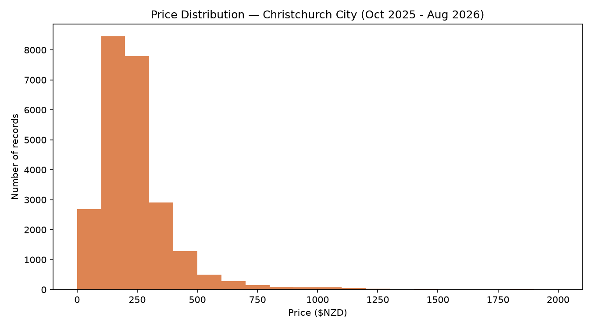
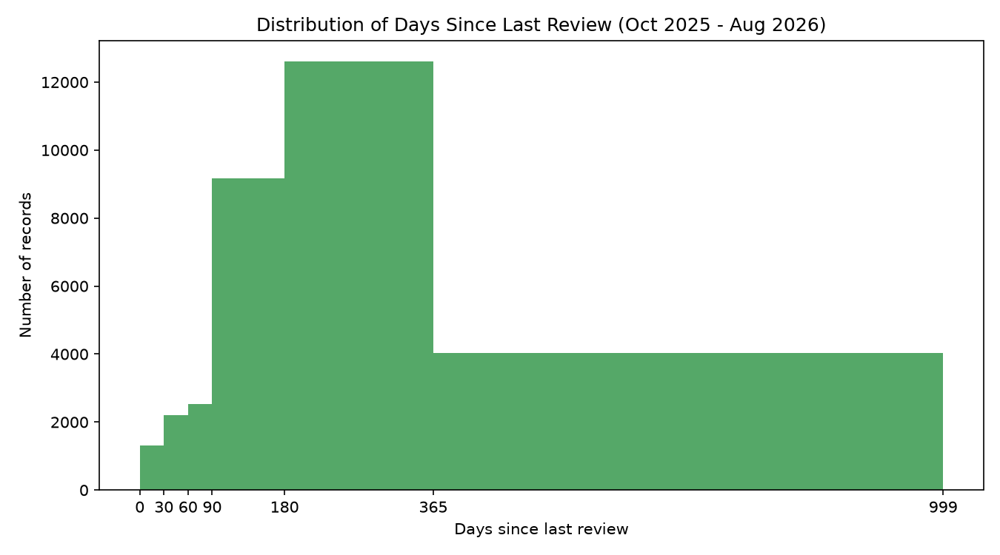
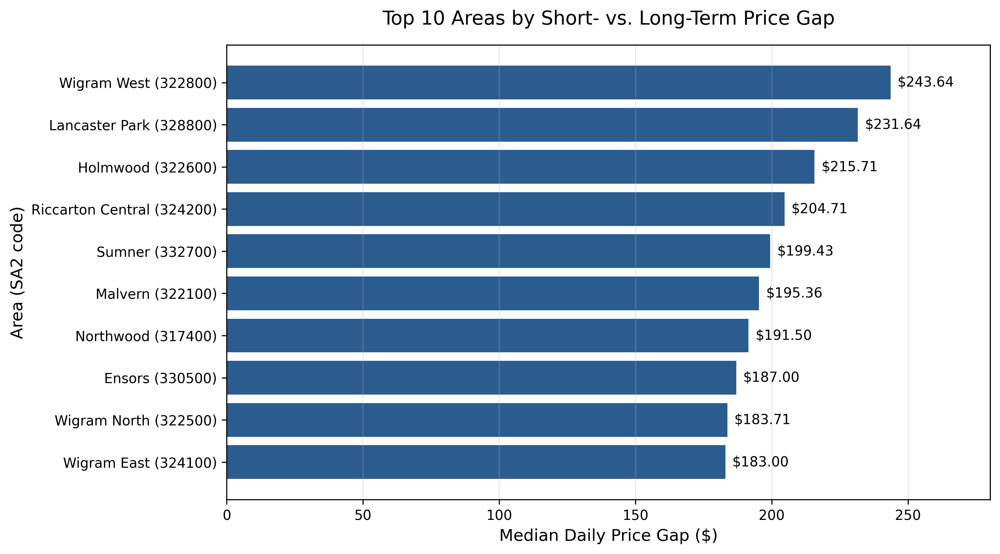
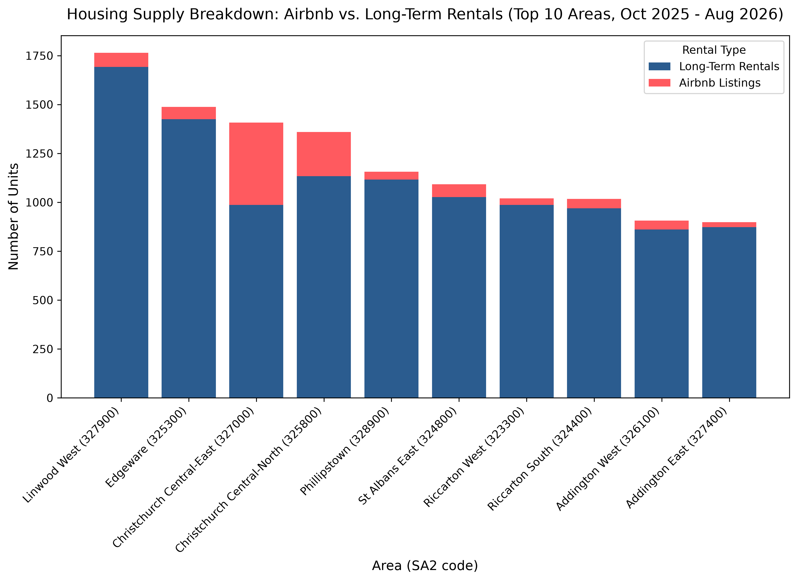

This report only reads results that the pipeline has already saved in `output/`;
it does no analysis itself. Rebuild it with `make` (or `python run_pipeline.py`).

```{python}
import sys
from pathlib import Path

import pandas as pd
from IPython.display import Markdown, display

sys.path.append(str(Path("src").resolve()))
import config

D3 = config.D3_OUTPUT_DIR
D5 = config.D5_OUTPUT_DIR
display(Markdown(
    f"**Data:** {len(config.AIRBNB_SNAPSHOT_MONTHS)} monthly Inside Airbnb snapshots "
    f"({config.snapshot_range_label()}) and the Tenancy Services bond quarters "
    f"{', '.join(config.BOND_QUARTERS)}."
))
```

## The combined Airbnb data





```{python}
pd.read_csv(D3 / "missing_values.csv", index_col=0).head(6)
```

## Q1: median nightly price in Christchurch Central

```{python}
q1 = pd.read_csv(D5 / "q1_median_airbnb_price.csv").iloc[0]
display(Markdown(
    f"The median nightly price in Christchurch Central (SA2 {q1['area_code']}) is "
    f"**${q1['median_price']:.2f}**, from {q1['listing_month_rows']:,} listing-month rows "
    f"({q1['unique_listings']:,} unique listings)."
))
```

## Q2: largest gap between Airbnb and long-term rent



```{python}
pd.read_csv(D5 / "location_price_gaps.csv").head(config.TOP_N).round(2)
```

## Q3: Airbnb supply vs long-term rentals



```{python}
pd.read_csv(D5 / "airbnb_vs_longterm_supply.csv").head(config.TOP_N).round(1)
```

**Note:** months whose quarter is not yet in the bond file have no rent data, so they
count towards Airbnb supply but not towards the rent comparisons in Q2.
